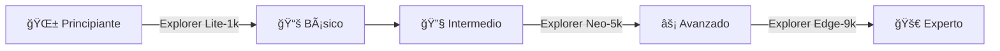

<div align="center">

# ⚡ FPGAeduDesign - Placas de Desarrollo

### *Empoderando a Creadores Digitales con Hardware Abierto*

**[🇬🇧 English](README.md)** | **[🇪🇸 Español](README.es.md)**

[](https://opensource.org/licenses/MIT)
[](/)
[](/)
[](/)

---

### 🎯 Acerca de Este Repositorio

*Placas de desarrollo FPGA de grado profesional diseñadas para educación, prototipado y experimentación*

</div>

---

### 🔌 Línea de Placas de Desarrollo

<table>
<tr>
<td width="33%" align="center">

#### 🟢 **Explorer Lite-1k**

*Potencia de Nivel Inicial*

Perfecta para principiantes y entornos educativos

**Ideal para:**
- 📚 Aprender fundamentos
- 🎓 Proyectos educativos
- 🧪 Prototipado rápido

</td>
<td width="33%" align="center">

#### 🟡 **Explorer Neo-5k**

*Campeón de Gama Media*

Rendimiento equilibrado para diseños intermedios

**Ideal para:**
- 🔧 Diseños lógicos complejos
- 🎮 Sistemas digitales
- 📡 Desarrollo de interfaces

</td>
<td width="33%" align="center">

#### 🔴 **Explorer Edge-9k**

*Plataforma Avanzada*

Solución de alta capacidad para proyectos serios

**Ideal para:**
- 💻 Desarrollo de SoC
- 🚀 DSP avanzado
- 🎛️ Prototipado profesional

</td>
</tr>
</table>

---

### 💡 Características Principales

<div align="center">

| Característica | Descripción |
|:--------------:|:------------|
| 🎨 **Soporte Dual HDL** | Ejemplos completos en VHDL y Verilog |
| 🔍 **Prueba de Periféricos** | Proyectos de validación listos para todos los componentes integrados |
| 📖 **Enfoque Educativo** | Tutoriales paso a paso y código bien comentado |
| 🛠️ **Hardware Abierto** | Esquemáticos completos y archivos de diseño disponibles |
| ⚡ **Inicio Rápido** | Proyectos preconfigurados para comenzar en minutos |

</div>

---

### 📂 Estructura del Repositorio

```
FPGAeduDesign-Boards/
│
├── 🔷 Explorer-Lite-1k/
│   ├── 📄 docs/              # Hojas de datos, guías de usuario, pines
│   └── 🔧 hardware/          # Archivos PCB, esquemáticos, BOM
│
├── 🔶 Explorer-Neo-5k/
│   ├── 📄 docs/
│   └── 🔧 hardware/
│
├── 🔺 Explorer-Edge-9k/
│   ├── 📄 docs/
│   └── 🔧 hardware/
│
├── 💻 examples/
│   ├── vhdl/                 # Diseños de referencia en VHDL
│   │   ├── led_blink/
│   │   ├── uart_loopback/
│   │   ├── spi_interface/
│   │   └── i2c_master/
│   │
│   └── verilog/              # Diseños de referencia en Verilog
│       ├── led_blink/
│       ├── uart_loopback/
│       ├── spi_interface/
│       └── i2c_master/
│
└── 📚 docs/                  # Documentación general
    ├── primeros_pasos.md
    ├── configuracion_herramientas.md
    └── preguntas_frecuentes.md
```

---

### 🚀 Inicio Rápido

```bash
# Clonar el repositorio
git clone https://github.com/FPGAeduDesign/FPGAeduDesign-Boards.git

# Navegar a tu placa
cd FPGAeduDesign-Boards/Explorer-Neo-5k

# Consultar la documentación
cd docs && cat primeros_pasos.md

# Probar un proyecto de ejemplo
cd ../examples/vhdl/led_blink
```

---

### 🎓 Ruta de Aprendizaje



---

### 🤝 Contribuciones

¡Aceptamos contribuciones! Ya sea:

- 🐛 Reportes de errores
- 💡 Solicitudes de características
- 📝 Mejoras en la documentación
- 🔧 Nuevos proyectos de ejemplo

Consulta nuestras [Guías de Contribución](CONTRIBUTING.md) para comenzar.

---

### 📜 Licencia

Este proyecto está licenciado bajo la **Licencia MIT** - consulta el archivo [LICENSE](LICENSE) para más detalles.

*¡Siéntete libre de aprender, modificar y construir sobre estos diseños!*

---

### 📞 Soporte y Comunidad

- 💬 **Discord**: [Únete a nuestra comunidad](https://discord.gg/fpgaedudesign)
- 🐦 **Twitter**: [@FPGAeduDesign](https://twitter.com/fpgaedudesign)
- 📧 **Email**: support@fpgaedudesign.com
- 📖 **Wiki**: [Centro de Documentación](https://wiki.fpgaedudesign.com)

---

<div align="center">

**Hecho con ⚡ por el Equipo FPGAeduDesign**

⭐ *¡Dale una estrella si te resulta útil!* ⭐

</div>
