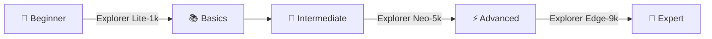

<div align="center">

# ⚡ FPGAeduDesign Development Boards

### *Empowering Digital Creators Through Open Hardware*

**[🇬🇧 English](README.md)** | **[🇪🇸 Español](README.es.md)**

[](https://opensource.org/licenses/MIT)
[](/)
[](/)
[](/)

---

### 🎯 About

*Professional-grade FPGA development boards designed for education, prototyping, and experimentation*

</div>

---

### 🔌 Board Lineup

<table>
<tr>
<td width="33%" align="center">

#### 🟢 **Explorer Lite-1k**

*Entry-Level Powerhouse*

Perfect for beginners and classroom environments

**Ideal for:**
- 📚 Learning fundamentals
- 🎓 Educational projects
- 🧪 Quick prototyping

</td>
<td width="33%" align="center">

#### 🟡 **Explorer Neo-5k**

*Mid-Range Champion*

Balanced performance for intermediate designs

**Ideal for:**
- 🔧 Complex logic designs
- 🎮 Digital systems
- 📡 Interface development

</td>
<td width="33%" align="center">

#### 🔴 **Explorer Edge-9k**

*Advanced Platform*

High-capacity solution for serious projects

**Ideal for:**
- 💻 SoC development
- 🚀 Advanced DSP
- 🎛️ Professional prototyping

</td>
</tr>
</table>

---

### 💡 Features

<div align="center">

| Feature | Description |
|:-------:|:------------|
| 🎨 **Dual HDL Support** | Complete examples in both VHDL and Verilog |
| 🔍 **Peripheral Testing** | Ready-to-use validation projects for all onboard components |
| 📖 **Educational Focus** | Step-by-step tutorials and well-commented code |
| 🛠️ **Open Hardware** | Full schematics and design files available |
| ⚡ **Quick Start** | Pre-configured projects to get you running in minutes |

</div>

---

### 📂 Repository Structure

```
FPGAeduDesign-Boards/
│
├── 🔷 Explorer-Lite-1k/
│   ├── 📄 docs/              # Datasheets, user guides, pinouts
│   └── 🔧 hardware/          # PCB files, schematics, BOM
│
├── 🔶 Explorer-Neo-5k/
│   ├── 📄 docs/
│   └── 🔧 hardware/
│
├── 🔺 Explorer-Edge-9k/
│   ├── 📄 docs/
│   └── 🔧 hardware/
│
├── 💻 examples/
│   ├── vhdl/                 # VHDL reference designs
│   │   ├── led_blink/
│   │   ├── uart_loopback/
│   │   ├── spi_interface/
│   │   └── i2c_master/
│   │
│   └── verilog/              # Verilog reference designs
│       ├── led_blink/
│       ├── uart_loopback/
│       ├── spi_interface/
│       └── i2c_master/
│
└── 📚 docs/                  # General documentation
    ├── getting_started.md
    ├── toolchain_setup.md
    └── faq.md
```

---

### 🚀 Quick Start

```bash
# Clone the repository
git clone https://github.com/FPGAeduDesign/FPGAeduDesign-Boards.git

# Navigate to your board
cd FPGAeduDesign-Boards/Explorer-Neo-5k

# Check the documentation
cd docs && cat getting_started.md

# Try an example project
cd ../examples/vhdl/led_blink
```

---

### 🎓 Learning Path



---

### 🤝 Contributing

We welcome contributions! Whether it's:

- 🐛 Bug reports
- 💡 Feature requests  
- 📝 Documentation improvements
- 🔧 New example projects

Check out our [Contributing Guidelines](CONTRIBUTING.md) to get started.

---

### 📜 License

This project is licensed under the **MIT License** - see the [LICENSE](LICENSE) file for details.

*Feel free to learn, modify, and build upon these designs!*

---

### 📞 Support & Community

- 🌐 **Website**: [fpgaedudesign.com](https://fpgaedudesign.com)
- 💬 **Discord**: [Join our community](https://discord.gg/fpgaedudesign)
- 🐦 **Twitter**: [@FPGAeduDesign](https://twitter.com/fpgaedudesign)
- 📺 **YouTube**: [@FPGAeduDesign](https://youtube.com/@FPGAeduDesign)
- 📘 **Facebook**: [FPGAeduDesign](https://facebook.com/fpgaedudesign)
- 📸 **Instagram**: [@FPGAeduDesign](https://instagram.com/fpgaedudesign)
- 🎥 **Kick**: [FPGAeduDesign](https://kick.com/fpgaedudesign)
- 🎵 **TikTok**: [@FPGAeduDesign](https://tiktok.com/@fpgaedudesign)
- 📧 **Email**: support@fpgaedudesign.com
- 📖 **Wiki**: [Documentation Hub](https://wiki.fpgaedudesign.com)

---

### 👨‍💻 Follow the Creator

- 📘 **Facebook**: [rsgb24](https://facebook.com/rsgb24)
- 🎵 **TikTok**: [@rsgb24](https://tiktok.com/@rsgb24)

---

<div align="center">

**Made with ⚡ by the FPGAeduDesign Team**

⭐ *Star this repo if you find it useful!* ⭐

</div>
